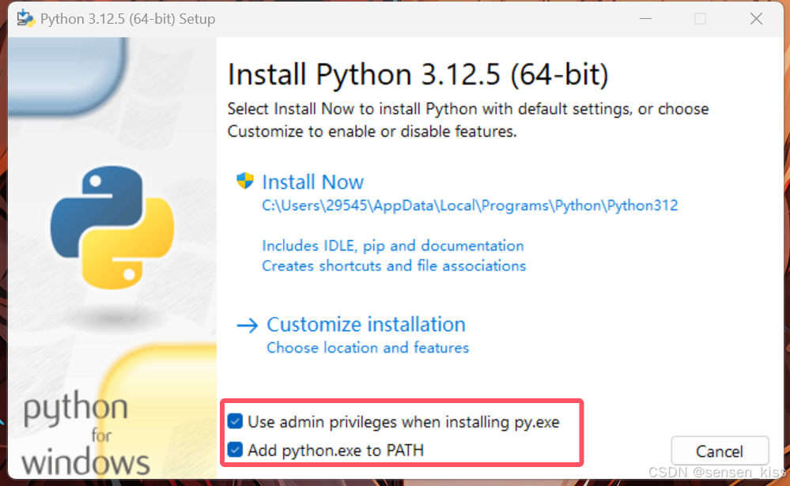
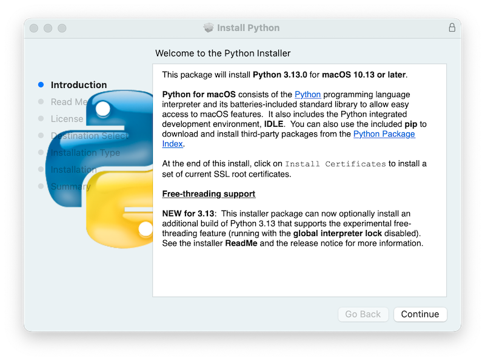

Choose a Python version for your project, identify the interpreter actually being run, then create a virtual environment. The following steps cover **Python 3.14**; screenshots of the standalone installer show the 3.12/3.13 interface.

## Windows: start with Python Install Manager

Official guidance now recommends obtaining **Python Install Manager** from [python.org](https://www.python.org/downloads/windows/) or Microsoft Store. Distinguish it from the older standalone `.exe` installer and legacy `py` launcher; consult the Windows documentation if their commands conflict.

After installing the manager, check its commands and install the required version. These examples select 3.14; check your project's dependency compatibility first:

```powershell
py help
py install 3.14
py list
py -3.14 --version
py -3.14 -c "import sys; print(sys.executable)"
```

The manager downloads the runtime. Check the official Windows support requirements for Python 3.14 rather than assuming that historical platform support still applies.

### Existing standalone 3.12/3.13 installers

You may still encounter the older interface. Start with a per-user installation for ordinary development; install for all users with elevated privileges only when that scope is needed. The `py` launcher selects versions, but does not make `python` resolve identically in every terminal.



Keep pip available. Debug symbols, debug binaries, and the full standard-library test suite are optional components. Choose PATH changes and file associations according to the interpreters already installed rather than selecting every option.

For a silent installation, use the exact filename of an installer you have already downloaded and checked. These older-installer options demonstrate a per-user installation:

```powershell
# Replace the filename with your verified installer
./python-3.13.7-amd64.exe /quiet InstallAllUsers=0 PrependPath=1 Include_test=0
```

The filename demonstrates syntax; it does not recommend 3.13.7 as the latest patch release. The 3.14 documentation marks the full installer as deprecated, so evaluate the install manager first for new environments.

## macOS

### Official installer

Download a package compatible with your macOS version and processor from [Python for macOS](https://www.python.org/downloads/macos/), then read its platform and license information.



After installation, follow the current installer's instructions for `Install Certificates.command` in the matching version directory. It downloads certificate components for that Python installation. Do not copy an outdated version directory from a screenshot.

```bash
python3 --version
python3 -c "import sys; print(sys.executable)"
```

Do not modify or remove Apple's `/usr/bin/python3`. An official Python installation can coexist with the interpreter used by Apple's developer tools.

### If you already use Homebrew

Check the [current Homebrew requirements](https://docs.brew.sh/Installation), including supported macOS, hardware, and Xcode Command Line Tools. They should not be summarized as a requirement to install system Python first.

In a terminal where Homebrew is configured:

```bash
brew --version
brew install python
python3 --version
command -v python3
```

If Homebrew is absent, follow its official installation guidance, downloading and reviewing the installer before execution. Diagnose terminal configuration before forcing link replacements.

## Linux: use distribution packages

### Debian / Ubuntu

```bash
sudo apt update
sudo apt install python3 python3-pip python3-venv
python3 --version
```

Installing Python does not require upgrading the entire machine, recursively changing ownership of `~/.local`, or deleting APT lock files. If a lock is held, identify the active package-management task, wait for it to finish, or follow the distribution's recovery guidance.

### Fedora

```bash
sudo dnf install python3 python3-pip
python3 --version
```

RHEL and other distributions have their own package versions and repository policies. Follow their documentation, preserve the system Python, and do not default to `sudo pip` for project dependencies.

## Create a virtual environment per project

Run these commands from the project directory. The Windows example explicitly selects an installed 3.14 runtime:

```powershell
py -3.14 -m venv .venv
.\.venv\Scripts\python.exe --version
.\.venv\Scripts\python.exe -m pip --version
```

macOS / Linux:

```bash
python3 -m venv .venv
.venv/bin/python --version
.venv/bin/python -m pip --version
```

Calling the environment's interpreter directly avoids changing PowerShell execution policy just to use the example. Use that same interpreter with `-m pip` when installing dependencies.

## Verification and common problems

- Record the OS, `--version`, `sys.executable`, and `pip --version`; confirm that they identify the intended environment.
- If `python` opens the Store or selects the wrong version, check application execution aliases, `py list`, and PATH.
- For `externally-managed-environment`, create a project virtual environment instead of bypassing distribution protections.
- If `venv` or `ensurepip` is missing, install the distribution's matching virtual-environment component and recreate the environment.

## Official references

- [Python on Windows](https://docs.python.org/3/using/windows.html)
- [Python on macOS](https://docs.python.org/3/using/mac.html)
- [Virtual environments with venv](https://docs.python.org/3/library/venv.html)
- [Homebrew installation requirements](https://docs.brew.sh/Installation)
