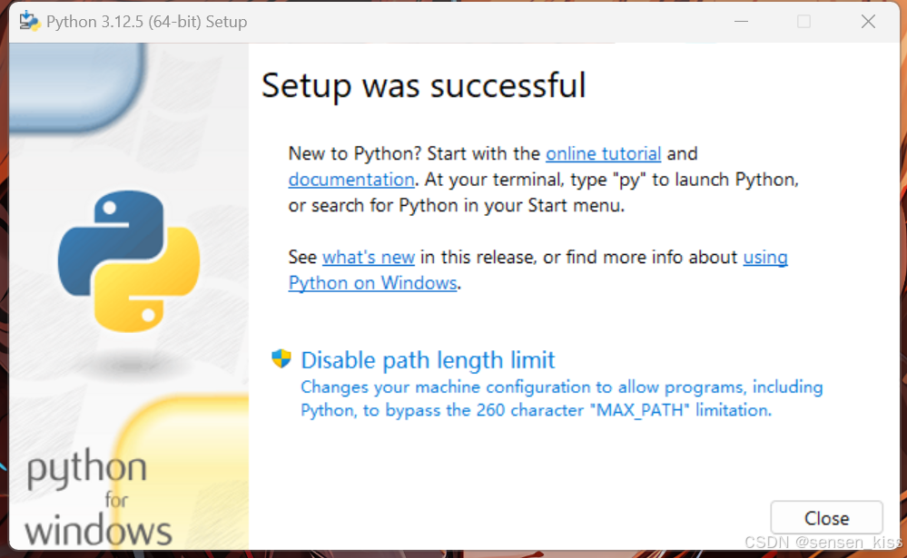
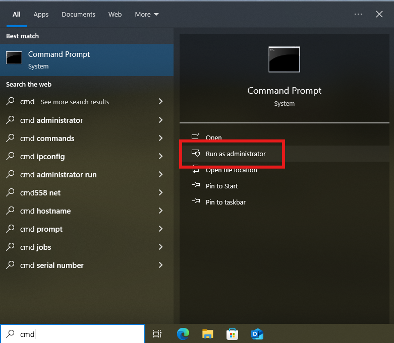
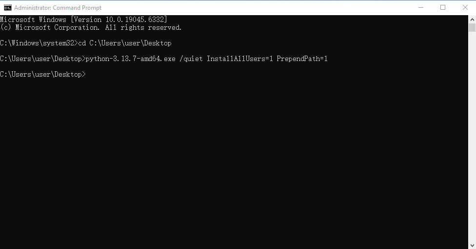

# How to Download and Install Python

Python is an interpreted, high-level and general-purpose programming language. Python’s design philosophy emphasizes
code readability with its notable use of significant whitespace. This article will serve as an informative guide and
give you a clear understanding of how to set up a Python environment.

## Windows

### Download Python Installation Packages

[Python for Windows](https://www.python.org/downloads/windows/) provides various versions of Python installation packages
for selection. Of course, considering that the speed of connecting to the Python official website in somewhere may be
slow, I recommend using a mirror site to download the Python installation package.

1. [Alibaba Mirror Site](https://mirrors.aliyun.com/python-release/windows)
2. [USTC Mirror Site](https://mirrors.ustc.edu.cn/python/)
3. .....

If you know of other mirror sites, please [contact me](mailto:libochen@codeglimpse.top) to update them!

### install Python

Here are a few common installation methods for Python, you can choose the one that suits you according to your needs.

#### The Simplest Manual Installation

1. Run the installer and select the following two options:
   The first option installs Python with administrator privileges.
   The second option automatically adds Python to your system environment path (highly recommended).
   
2. Click **Install Now**
3. Click **Close** , Installation complete!
   

#### Customize installation

1. Run the installer, still recommended to select the following two options:
   
2. Click **Customize installation**
3. Choose optional features as needed:
   
    - Documentation: Documentation and help files for installing Python. Select this option only needed
    - pip: Python package management tool. Very important, must choose
    - tcl/tk and IDLE: tcl/tk and IDLE are two graphical user interfaces, IDLE is Integrated Development Environment and
      Learning，a python IDE that comes with it. However, we recommend using Pycharm as an IDE for learning.
    - Python test suite: Provides a set of test suites for testing Python interpreters and standard libraries. Although
      beginners generally do not need to use it, this kit is still very useful, it is recommended to choose it.
    - py launcher: Ensure user starts python using python commands in the command line
    - for all users（requires admin privileges）: Ask if choose 'py launcher' for all users on the computer. Recommended
      to choose
4. Click **Next**
5. Choose advanced option as needed:
   
    - Install Python 3.12 for all users: Generally has no effect on use, but still recommended to choose it
    - Associate files with Python (requires the 'py' launcher): Enable the system to automatically associate Python with
      specific file types. When double click Python script files in File Explorer, the system will automatically use the
      Python interpreter to run these scripts. This can be chosen as needed, but usually the file will be associated
      with Pycharm later on
    - Create shortcuts for installed applications: Create desktop shortcuts. Generally, there is no need to choose
    - Add Python to environment variables: Selecting this option adds the path to the Python interpreter to the system's
      environment variables, so that the Python interpreter can be run directly from the command line without having to
      enter the full path. Recommended to choose
    - Precompile standard library: Pre-compiled the Python standard library to improve the import speed of standard
      library modules. This can be chosen or not
    - Download debugging symbols: Debug symbols for developers and debuggers. Choose only need
    - Download debug binaries (requires VS 2017 or later): A binary file for debug versions for developers and
      debuggers. Choose only need
6. Select the directory for installation
7. Click **Install**
8. Click **Close** , Complete the installation
   

#### The Simplest silent installation/automatic installation

1. Find the installation package, right-click **Properties**
2. Record the **File Name** and the installation package path in the **Location**.
   
3. Type `cmd` in the bottom-left corner of the desktop to open the command prompt as an administrator
   
4. Enter the following commands in sequence:
    ```bat
    cd C:\Users\user\Desktop
    python-3.13.7-amd64.exe /quiet InstallAllUsers=1 PrependPath=1
    ```
   > Attention: <br>
   > &emsp;&emsp;Replace C:\Users\user\Desktop with the installation package path from Step 2.<br>
   > &emsp;&emsp;Replace python-3.13.7-amd64.exe with the filename from Step 2. (don't forget the .exe)

   

5. After waiting a few minutes, check in the Start menu to see if the installation is complete.
   

#### Custom Script Installation

1. Create a new text file and name it as `unattend.xml`
2. Fill in the content:

    ```xml
    <Options>
    <Option Name="InstallAllUsers" Value="1" />
    <Option Name="TargetDir" Value="C:\Python313" />
    <Option Name="DefaultAllUsersTargetDir" Value="C:\Python313" />
    <Option Name="DefaultJustForMeTargetDir" Value="C:\Python313" />
    <Option Name="DefaultCustomTargetDir" Value="C:\Python313" />
    <Option Name="AssociateFiles" Value="1" />
    <Option Name="CompileAll" Value="1" />
    <Option Name="PrependPath" Value="1" />
    <Option Name="AppendPath" Value="0" />
    <Option Name="Shortcuts" Value="1" />
    <Option Name="Include_doc" Value="1" />
    <Option Name="Include_debug" Value="1" />
    <Option Name="Include_dev" Value="1" />
    <Option Name="Include_exe" Value="1" />
    <Option Name="Include_launcher" Value="1" />
    <Option Name="InstallLauncherAllUsers" Value="1" />
    <Option Name="Include_lib" Value="1" />
    <Option Name="Include_pip" Value="1" />
    <Option Name="Include_symbols" Value="1" />
    <Option Name="Include_tcltk" Value="1" />
    <Option Name="Include_test" Value="1" />
    <Option Name="Include_tools" Value="1" />
    <Option Name="LauncherOnly" Value="0" />
    <Option Name="SimpleInstall" Value="0" />
    <Option Name="SimpleInstallDescription"></Option>
    </Options>
    ```

    | **Name**                  | **Description**                                                                                     | **Default**                                                                                                           |
    |---------------------------|-----------------------------------------------------------------------------------------------------|-----------------------------------------------------------------------------------------------------------------------|
    | InstallAllUsers           | Perform a system-wide installation.                                                                 | 0                                                                                                                     |
    | TargetDir                 | The installation directory                                                                          | Selected based on InstallAllUsers                                                                                     |
    | DefaultAllUsersTargetDir  | The default installation directory for all-user installs                                            | %ProgramFiles%\Python X.Y or %ProgramFiles(x86)%\Python X.Y                                                           |
    | DefaultJustForMeTargetDir | The default install directory for just-for-me installs                                              | %LocalAppData%\Programs\Python\PythonXY or %LocalAppData%\Programs\PythonXY-32 or %LocalAppData%\Programs\PythonXY-64 |
    | DefaultCustomTargetDir    | The default custom install directory displayed in the UI                                            | (empty)                                                                                                               |
    | AssociateFiles            | Create file associations if the launcher is also installed                                          | 1                                                                                                                     |
    | CompileAll                | Compile all .py files to .pyc                                                                       | 0                                                                                                                     |
    | PrependPath               | Prepend install and Scripts directories to PATH and add .PY to PATHEXT                              | 0                                                                                                                     |
    | AppendPath                | Append install and Scripts directories to PATH and add .PY to PATHEXT                               | 0                                                                                                                     |
    | Shortcuts                 | Create shortcuts for the interpreter, documentation and IDLE if installed                           | 1                                                                                                                     |
    | Include_doc               | Install Python manual                                                                               | 1                                                                                                                     |
    | Include_debug             | Install debug binaries                                                                              | 0                                                                                                                     |
    | Include_dev               | Install developer headers and libraries. Omitting this may lead to an unusable installation.        | 1                                                                                                                     |
    | Include_exe               | Install python.exe and related files. Omitting this may lead to an unusable installation.           | 1                                                                                                                     |
    | Include_launcher          | Install Python Launcher for Windows                                                                 | 1                                                                                                                     |
    | InstallLauncherAllUsers   | Installs the launcher for all users. Also requires Include_launcher to be set to 1                  | 1                                                                                                                     |
    | Include_lib               | Install standard library and extension modules. Omitting this may lead to an unusable installation. | 1                                                                                                                     |
    | Include_pip               | Install bundled pip and setuptools                                                                  | 1                                                                                                                     |
    | Include_symbols           | Install debugging symbols (*.pdb)                                                                   | 0                                                                                                                     |
    | Include_tcltk             | Install Tcl/Tk support and IDLE                                                                     | 1                                                                                                                     |
    | Include_test              | Install standard library test suite                                                                 | 1                                                                                                                     |
    | Include_tools             | Install utility scripts                                                                             | 1                                                                                                                     |
    | LauncherOnly              | Only installs the launcher. This will override most other options.                                  | 0                                                                                                                     |
    | SimpleInstall             | Disable most install UI                                                                             | 0                                                                                                                     |
    | SimpleInstallDescription  | A custom message to display when the simplified install UI is used                                  | (empty)                                                                                                               |

        Usually, the value is typically 0 to disable a feature, and 1 to enable a feature or path.

3. Run the installation command:
   ```bat
   cd C:\Users\user\Desktop
   python-3.13.7-amd64.exe /quiet .\unattend.xml
    ```

4. Verify Installation:
   ```bat
   python -V 
    ```


## MacOS

For macOS, we need to check whether the system has a pre-installed python environment.

- If you're using macOS Monterey 12.2 or earlier, you may already have Python 2.7 pre-installed. However, the latest version has been upgraded to Python 3, which has significant improvements and improved security compared to Python 2.7. Additionally, Python 2.7 is outdated and no longer officially supported
- If you are using macOS Monterey 12.3 or later, Apple has completely removed Python 2.7 and will need to install Python manually

To check if your macOS has Python installed, open Terminal and do something like this:
- Run `python --version` If the version is 2.7.*, Python 2.7 is pre-installed
- Run `python3 --version` If the version is 3.x.*, Python 3 is pre-installed

> **Note：**
> Recent versions of macOS include a **python3** command in `/usr/bin/python3` that links to a usually older and incomplete version of Python provided by and for use by the Apple development tools, **Xcode** or the **Command Line Tools for Xcode**
> You should never modify or attempt to delete this installation, as it is Apple-controlled and is used by Apple-provided or third-party software
> If you choose to install a newer Python version from `python.org`, you will have two different but functional Python installations on your computer that can co-exist
> The default installer options should ensure that its **python3** will be used instead of the system **python3**

Here are a few common installation methods for Python, and you can choose the one that suits you according to your needs.

### Install Python through the official installer

1. Download the Python installer:
   Visit the macOS download address on the Python official website: [Python for macOS](https://www.python.org/downloads/macos/)
   Alternatively, you can download the installer by visiting the mirror website:

   - [Alibaba Mirror Site](https://mirrors.aliyun.com/python-release/macos)
   - [USTC Mirror Site](https://mirrors.ustc.edu.cn/python/)、
   - .....

   If you know of other mirror sites, please [contact me](mailto:libochen@codeglimpse.top) to update them!
2. After the installer is downloaded, open the Finder - find the .pkg file in the Downloads folder – double-click to open it to start the installation
   
3. Clicking on the **Continue** button brings up the **Read Me** for this installer. Besides other important information, the **Read Me** documents which Python version is going to be installed and on what versions of macOS it is supported
   
4. Clicking on **Continue** proceeds to display the license for Python and for other included software. You will then need to **Agree** to the license terms before proceeding to the next step
   
5. After the license terms are accepted, the next step is the **Installation Type** display. For most uses, the standard set of installation operations is appropriate. If you need to customize the installation, please refer to the introduction of [Windows customize installation](#customize-installation)
   
6. In either case, clicking **Install** will begin the install process by asking permission to install new software. A macOS user name with `Administrator` privilege is needed as the installed Python will be available to all users of the Mac
   
7. Locate and double-click the **Install Certificates.command** icon in the folder that pops up or find the file in `/Applications/Python 3.13/` and double-click to complete the installation
   
8. This will open a temporary **Terminal** shell window that will use the new Python to download and install SSL root certificates for its use
   
9. If `Successfully installed certifi` and `update complete` appears in the terminal window, the installation is complete. Close this terminal window and the installer window

### Install Python with Homebrew
Another way to install Python on macOS is to use Homebrew. Homebrew is a third-party package manager for macOS that allows for quick application installation using Terminal, providing macOS with a Linux-like package management experience.
Interestingly, Homebrew requires support for Python to work properly. Therefore, installing Homebrew requires available Python support, which is the older version of Python used by Apple's system developer tools mentioned earlier.
To install Python on macOS using Homebrew, follow these steps:
1. Open the **Terminal** application – Run the `brew --version` command to check if Homebrew is installed:
   
2. If Homebrew is already installed, skip straight to step 4
   If Homebrew is not installed, run the following command in Terminal to install Homebrew:
   ```bash
   /bin/bash -c "$(curl -fsSL https://raw.githubusercontent.com/Homebrew/install/HEAD/install.sh)"
   ```
   
3. Once you have Homebrew installed, you can use it to install Python:
   
4. Run Brew Link Python or Brew Link python@3. XX (replace XX with the correct version number) - Then restart the Terminal application to make sure the application is working properly
   
5. Once the installation is complete, you can run the `python -–version` or `python3 –-version` command to verify the installation