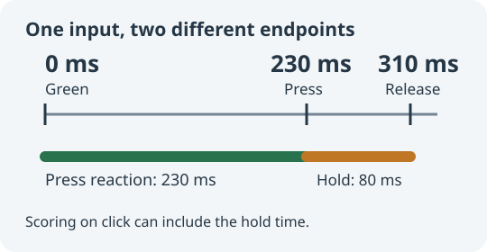

The [reaction test](/en/games/reaction/) on this site once reported over 300 milliseconds for a person who typically measured about 220–250 milliseconds elsewhere. The old implementation included the time between pressing and releasing the mouse button.

## A click usually arrives after the press

A typical mouse click includes a press, a release, and then a `click` event. If the intended measurement is how quickly someone presses after seeing green, handling `click` can select a later endpoint.

In a controlled browser-input comparison, the mouse was pressed 230 milliseconds after green, held for 80 milliseconds, and released. The old implementation recorded **310 milliseconds** on release. The corrected implementation records **230 milliseconds** on press and ignores the later release for scoring.



Those numbers are specified test timings, not average human reaction times or a fixed correction to subtract from every score.

## Define the input endpoint

The game now records these events:

| Input | Measurement endpoint |
| --- | --- |
| Mouse | Primary-button `pointerdown` |
| Touch | The primary pointer contacting the panel |
| Keyboard | The initial Space or Enter `keydown`, excluding auto-repeat |
| Virtual activation from assistive technology | A supported `click` path without duplicate scoring |

A compatibility `click` following an already-recorded mouse or touch press must not start another round. Additional pointers, non-primary buttons, and modifier combinations should not count as ordinary reactions.

## Measure when the event happened

An event may occur before the main thread can process it. If a press occurs at 230 milliseconds but its handler runs at 310, reading `performance.now()` inside that handler includes 80 milliseconds of queue delay.

The input path therefore prefers the event's `timeStamp`, normalized to the same clock as the start time. The core call is:

```javascript
const pressedAt = inputTime(
    event.timeStamp,
    performance.now(),
    performance.timeOrigin
);
state = respond(state, pressedAt);
```

Normalization handles invalid values and older timestamps based on Unix time rather than the page's time origin. Subtracting unrelated clocks is not meaningful.

It also affects false starts: a press that occurred before green remains early even if it is processed after the signal appears.

## Align the visual update and start time

A timeout expiring means its callback can run; it does not prove that the display is already green. Starting a timer before updating the display can include extra presentation delay.

After the random wait, the game updates the panel and records its start in the same animation-frame callback. Omitting pause and state checks, the sequence is:

```javascript
requestAnimationFrame(() => {
    render('ready');
    state = arm(state, performance.now());
});
```

`requestAnimationFrame` runs before painting, narrowing the gap between the script update and the next paint. **It is not a timestamp of the physical pixels lighting up.** Display refresh, input hardware, browser behavior, and operating-system scheduling still affect the result.

## Pauses and restarts belong to the timing model

Pausing or leaving the game cancels both the pending timeout and any scheduled signal frame. Resuming starts a new wait while keeping completed samples. Otherwise an old callback could turn a new round green unexpectedly.

Early presses do not count toward the five valid samples. After a result, another press begins the next wait. Restarting clears the current round and pending work.

Use the same device, input method, and similar foreground conditions when comparing sites. These changes remove identifiable event-endpoint and queue-delay errors; a browser game still does not replace dedicated measurement hardware.

## Further reading

- [Play the reaction test](/en/games/reaction/)
- [Game controller source](https://github.com/CodeGlimpse/CodeGlimpse.github.io/blob/master/assets/js/games/reaction.js)
- [MDN: pointerdown](https://developer.mozilla.org/en-US/docs/Web/API/Element/pointerdown_event)
- [MDN: Event.timeStamp](https://developer.mozilla.org/en-US/docs/Web/API/Event/timeStamp)
- [MDN: requestAnimationFrame](https://developer.mozilla.org/en-US/docs/Web/API/Window/requestAnimationFrame)
