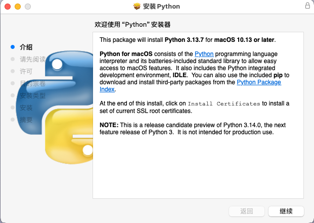

先选择适合项目的 Python 版本，再确认实际执行的解释器，最后为项目创建虚拟环境。本次以 **Python 3.14 官方文档**复核通用流程；旧截图展示的是 3.12/3.13 安装器，不代表当前默认安装界面。

## Windows：优先了解 Python Install Manager

官方目前推荐从 [python.org](https://www.python.org/downloads/windows/) 或 Microsoft Store 获取 **Python Install Manager**。它与旧版独立 `.exe` 安装器及旧 `py` 启动器需要区分；遇到命令冲突时先查看官方 Windows 文档。

安装管理器后，在 PowerShell 中确认可用命令，再安装所需版本。以下以 3.14 为例，实际项目仍需检查依赖兼容性：

```powershell
py help
py install 3.14
py list
py -3.14 --version
py -3.14 -c "import sys; print(sys.executable)"
```

管理器会下载运行时。Python 3.14 的 Windows 支持范围见官方说明；不要把旧系统支持和当前受维护系统混为一谈。

### 已有 3.12/3.13 独立安装器时

旧界面仍可能在已有环境中出现。一般开发场景先选择当前用户安装；只有明确需要所有用户共用时，才选择系统范围安装并提升权限。`py` 启动器提供版本选择，不等于所有终端中的 `python` 都会指向同一个解释器。


安装时保留 pip；调试符号、调试二进制和完整标准库测试套件是按需组件。PATH 和文件关联也应结合已有解释器决定，不要统一勾选全部选项。

静默安装必须使用**已经下载并核对的具体安装器文件名**。例如，下面的参数用于旧安装器的当前用户安装：

```powershell
# 将文件名替换为已核对的安装包
./python-3.13.7-amd64.exe /quiet InstallAllUsers=0 PrependPath=1 Include_test=0
```

这里的文件名仅演示旧安装器语法，不表示 3.13.7 是推荐下载的最新补丁版本。3.14 文档已将完整安装器列为弃用方式，新环境应先评估安装管理器。

## macOS

### 使用官方安装包

从 [Python for macOS](https://www.python.org/downloads/macos/) 下载与你的 macOS 和处理器兼容的安装包，阅读安装器中的支持范围与许可说明。



安装完成后，按当前安装器说明运行对应版本目录中的 `Install Certificates.command`。它会联网安装该 Python 使用的证书组件。不要照抄旧截图中的版本目录。

```bash
python3 --version
python3 -c "import sys; print(sys.executable)"
```

不要删除或修改 Apple 管理的 `/usr/bin/python3`。官方 Python 可以与系统开发工具使用的解释器并存。

### 已使用 Homebrew 时

先查看 [Homebrew 当前安装要求](https://docs.brew.sh/Installation)。其要求涉及受支持的 macOS、硬件和 Xcode Command Line Tools，不能概括为“必须先安装系统 Python”。

在 Homebrew 已正常配置的终端中：

```bash
brew --version
brew install python
python3 --version
command -v python3
```

如果尚未安装 Homebrew，先按官网说明下载、审阅安装脚本再执行。出现路径冲突时先检查终端配置，不要直接强制覆盖链接。

## Linux：使用发行版软件包

### Debian / Ubuntu

```bash
sudo apt update
sudo apt install python3 python3-pip python3-venv
python3 --version
```

安装 Python 不需要顺带升级整台机器、修改整个 `~/.local` 的所有者或删除 APT 锁文件。遇到锁占用时，先确认另一个包管理任务是否仍在运行，等待完成或按发行版的故障处理流程排查。

### Fedora

```bash
sudo dnf install python3 python3-pip
python3 --version
```

RHEL 及其他发行版的软件包版本和仓库策略不同，应按对应发行版文档选择。不要替换系统 Python，也不要默认使用 `sudo pip` 安装项目依赖。

## 为每个项目创建虚拟环境

在项目目录中执行。Windows 示例明确使用已安装的 3.14：

```powershell
py -3.14 -m venv .venv
.\.venv\Scripts\python.exe --version
.\.venv\Scripts\python.exe -m pip --version
```

macOS / Linux：

```bash
python3 -m venv .venv
.venv/bin/python --version
.venv/bin/python -m pip --version
```

直接调用虚拟环境中的解释器即可，不必为了运行示例而修改 PowerShell 执行策略。安装依赖时沿用同一个解释器的 `-m pip`。

## 验收与常见问题

- 记录操作系统、`--version` 输出、`sys.executable` 和 `pip --version`，确认它们属于预期环境。
- `python` 打开商店或版本不对：检查应用执行别名、`py list` 与 PATH。
- 提示 `externally-managed-environment`：为项目创建虚拟环境，不绕过发行版保护。
- 缺少 `venv`/`ensurepip`：安装发行版对应的虚拟环境组件，再重新创建环境。

## 官方依据

- [Python on Windows](https://docs.python.org/3/using/windows.html)
- [Python on macOS](https://docs.python.org/3/using/mac.html)
- [venv 虚拟环境](https://docs.python.org/3/library/venv.html)
- [Homebrew 安装要求](https://docs.brew.sh/Installation)
