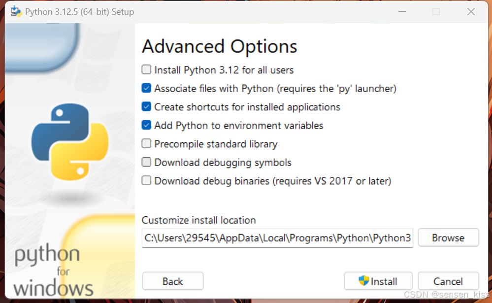

# Python的下载及安装

Python是一种解释型、高级和通用的编程语言。Python的设计理念强调代码的可读性，并显著使用了大量空格。本文将作为一个信息丰富的指南，让您清楚地了解如何下载及安装python语言环境。

## Python的下载

[Python官网](https://www.python.org/downloads/)提供了各种版本的Python安装包可供选择。当然，鉴于国内连接Python官网的速度可能很慢，我推荐使用镜像站下载Python安装包。

1. [阿里镜像站](https://mirrors.aliyun.com/python-release/)
2. [中科大镜像站](https://mirrors.ustc.edu.cn/python/)
3. .....

如您了解其他镜像站欢迎[联系我](mailto:libochen@codeglimpse.top)更新！

## Python的安装

### Windows

#### 手动安装

##### 极简版

1. 运行安装包，建议勾选下面两项：
   第一个表示以管理员权限安装Python
   第二个表示自动添加Python的环境路径（强烈建议勾选）
   
2. 点击 **Install Now**
3. 点击 **Close** ，完成安装！
   

##### 自定义安装

1. 运行安装包，依旧建议勾选下面两项：
   
2. 点击 **Customize installation**
3. 根据需要选择可选功能
   
   - Documentation：安装Python的文档和帮助文件。这个可以根据需要勾选
   - pip：安装Python包管理工具。非常关键，必选
   - tcl/tk and IDLE：其中tcl/tk是两个图形用户界面，而IDLE的名字是Integrated Development Environment and Learning
   - Environment（集成开发环境和学习环境），是一个python自带的ide。不过我们更推荐使用pycharm作为ide进行学习。
   - Python test suite：Python官方提供的一套用于测试Python解释器和标准库的测试套件。虽然初学一般不需要用到，但是这个套件还是很有用的，建议勾选。
   - py launcher for all users（requires admin privileges）：首先py launcher可以保证用户在命令行里使用python命令启动python，而后半句for
   - all users是询问是否为电脑上的所有用户安装上python，而这一步需要管理员权限，对应的是括号里的那句话。
4. 点击 **Next**
5. 根据需要选择高级选项
   
   - Install Python 3.12 for all users：为所有用户安装。一般对使用没有影响，但是还是建议勾选
   - Associate files with Python（requires the 'py' launcher）：让系统自动将 Python 关联到特定的文件类型。使得在文件资源管理器中双击
   - Python 脚本文件时，系统会自动使用 Python 解释器来运行这些脚本。这个可以按需勾选，不过一般后续会将文件关联到Pycharm
   - Create shortcuts for installed applications：创建桌面快捷方式。一般不需要勾选
   - Add Python to environment variables：选择这个选项会将 Python 解释器的路径添加到系统的环境变量中，这样就可以在命令行中直接运行
   - Python 解释器而不需要输入完整的路径。这个推荐勾选
   - Precompile standard library：对 Python 标准库进行预编译，以提高标准库模块的导入速度。这个可勾可不勾
   - Download debugging symbols：给开发人员和调试人员用的调试符号。按需勾选
   - Download debug binaries（requires VS 2017 or later）：给开发人员和调试人员用的调试版本的二进制文件。按需勾选
6. 选择安装目录，建议路径中不要含有中文，否则可能会导致安装失败。
7. 点击 **Install**
8. 点击 **Close** ，完成安装！
   

#### 静默安装/自动安装

##### 极简安装

1. 找到安装包，右键点击**属性**
2. 记录下**文件名**以及**位置**中的安装包路径
   
3. 在桌面左下角输入 `cmd` ，以管理员身份打开命令行
   
4. 依次输入如下命令：
    ```bat
    cd C:\Users\user\Desktop
    python-3.13.7-amd64.exe /quiet InstallAllUsers=1 PrependPath=1
    ```
   > 注意：<br>
   > &emsp;&emsp;请将 C:\Users\user\Desktop 替换为第2步中位置中的安装包路径<br>
   > &emsp;&emsp;请将 python-3.13.7-amd64.exe 替换为第2步中文件名 + .exe

   

5. 等待几分钟后在开始菜单检查是否安装完成
   

##### 自定义安装

1. 新建文本文件，命名为 `unattend.xml`
2. 填写内容

    ```xml
    <Options>
    <Option Name="InstallAllUsers" Value="1" />
    <Option Name="TargetDir" Value="C:\Python313" />
    <Option Name="DefaultAllUsersTargetDir" Value="C:\Python313" />
    <Option Name="DefaultJustForMeTargetDir" Value="C:\Python313" />
    <Option Name="DefaultCustomTargetDir" Value="C:\Python313" />
    <Option Name="AssociateFiles" Value="1" />
    <Option Name="CompileAll" Value="1" />
    <Option Name="PrependPath" Value="1" />
    <Option Name="AppendPath" Value="0" />
    <Option Name="Shortcuts" Value="1" />
    <Option Name="Include_doc" Value="1" />
    <Option Name="Include_debug" Value="1" />
    <Option Name="Include_dev" Value="1" />
    <Option Name="Include_exe" Value="1" />
    <Option Name="Include_launcher" Value="1" />
    <Option Name="InstallLauncherAllUsers" Value="1" />
    <Option Name="Include_lib" Value="1" />
    <Option Name="Include_pip" Value="1" />
    <Option Name="Include_symbols" Value="1" />
    <Option Name="Include_tcltk" Value="1" />
    <Option Name="Include_test" Value="1" />
    <Option Name="Include_tools" Value="1" />
    <Option Name="LauncherOnly" Value="0" />
    <Option Name="SimpleInstall" Value="0" />
    <Option Name="SimpleInstallDescription"></Option>
    </Options>
    ```
    
    | 名称                        | 描述                                    | 默认值                                                                                                                               |
    |---------------------------|---------------------------------------|-----------------------------------------------------------------------------------------------------------------------------------|
    | InstallAllUsers           | 为所有用户安装。                              | 0                                                                                                                                 |
    | TargetDir                 | 安装目录                                  | 基于InstallAllUsers选择                                                                                                               |
    | DefaultAllUsersTargetDir  | 为所有用户安装时的默认安装路径                       | %ProgramFiles%\Python X.Y 或 %ProgramFiles(x86)%\Python X.Y                                                                        |
    | DefaultJustForMeTargetDir | 仅为当前用户安装时的默认安装路径                      | %LocalAppData%\Programs\Python\PythonXY 或 %LocalAppData%\Programs\Python\PythonXY-32 或 %LocalAppData%\Programs\Python\PythonXY-64 |
    | DefaultCustomTargetDir    | UI中显示的默认自定义安装目录                       | （空）                                                                                                                               |
    | AssociateFiles            | 如果还安装了启动器，则创建文件关联。                    | 1                                                                                                                                 |
    | CompileAll                | 将所有 .py 文件编译为 .pyc 。                  | 0                                                                                                                                 |
    | PrependPath               | 将安装和脚本目录添加到 PATH 并将 .PY 添加到 PATHEXT   | 0                                                                                                                                 |
    | AppendPath                | 将安装和脚本目录添加到 PATH 并将 .PY 添加到 PATHEXT   | 0                                                                                                                                 |
    | Shortcuts                 | 如果已安装，为解释器，文档和IDLE创建快捷方式              | 1                                                                                                                                 |
    | Include_doc               | 安装Python手册                            | 1                                                                                                                                 |
    | Include_debug             | 安装调试二进制文件                             | 0                                                                                                                                 |
    | Include_dev               | 安装开发者头文件和库文件。 省略这一步可能导致安装不可用。         | 1                                                                                                                                 |
    | Include_exe               | 安装 python.exe 以及相关文件。忽略此项可能会导致安装不可用。  | 1                                                                                                                                 |
    | Include_launcher          | 安装适用于Windows的Python启动器                | 1                                                                                                                                 |
    | InstallLauncherAllUsers   | 为所有用户安装启动器。还需要 Include_launcher 被设定为1 | 1                                                                                                                                 |
    | Include_lib               | 安装标准库和扩展模块。 省略这一步可能导致安装不可用。           | 1                                                                                                                                 |
    | Include_pip               | 安装捆绑的pip和setuptools                   | 1                                                                                                                                 |
    | Include_symbols           | 安装调试符号集 (*.pdb)                       | 0                                                                                                                                 |
    | Include_tcltk             | 安装Tcl/Tk 支持和IDLE                      | 1                                                                                                                                 |
    | Include_test              | 安装标准库测试套件                             | 1                                                                                                                                 |
    | Include_tools             | 安装实用程序脚本                              | 1                                                                                                                                 |
    | LauncherOnly              | 仅安装启动器。这将覆盖大多数其他选项。                   | 0                                                                                                                                 |
    | SimpleInstall             | 禁用大多数安装UI                             | 0                                                                                                                                 |
    | SimpleInstallDescription  | 使用简化安装UI时显示的自定义消息。                    | （空）                                                                                                                               |

        其中，值通常是 0 来禁用某个特性， 1 来启用某个特性或路径

3. 运行安装命令
   ```bat
   cd C:\Users\user\Desktop
   python-3.13.7-amd64.exe /quiet .\unattend.xml
    ```
   
4. 验证安装
   ```bat
   python -V 
    ```
