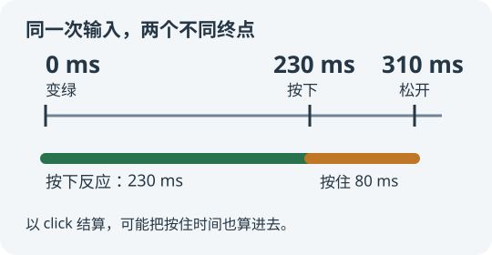

本站[反应测试](/games/reaction/)曾出现一个问题：同一个人在其他站点大约测得 220–250 毫秒，在这里却经常超过 300 毫秒。排查后发现，旧实现把鼠标从按下到松开的时间也算进去了。

## click 往往比按下更晚

一次常见的鼠标点击包含按下、松开，随后才产生 `click`。如果测试目标是“看到变绿后，多久按下按钮”，在 `click` 中计时就可能测到另一个终点。

用可控的浏览器输入进行对照：变绿后 230 毫秒按下，继续按住 80 毫秒再松开。旧实现到松开时记录 **310 毫秒**；修正后在按下时记录 **230 毫秒**，松开不会再次计分。



这里的 230 和 80 是测试中指定的时间，不是人的平均反应值，也不是应该给所有成绩减去的固定偏差。

## 先明确输入的终点

本站现在按以下边界结算：

| 输入方式 | 记录时机 |
| --- | --- |
| 鼠标 | 主按钮的 `pointerdown` |
| 触屏 | 手指接触面板产生的主指针按下 |
| 键盘 | 空格或回车的首次 `keydown`，忽略按住后的连发 |
| 辅助技术的虚拟激活 | 保留相应的 `click` 路径，并避免重复结算 |

鼠标或触摸按下已经计分后，其后产生的兼容 `click` 不应再开新一轮。第二个触点、非主按钮和修饰键组合也不应被当成正常反应。

## 用事件时间，而不是处理事件时的时间

事件可能先发生，再排队等待主线程处理。假设按下发生在第 230 毫秒，处理函数到第 310 毫秒才执行：直接取处理函数里的 `performance.now()`，会把这 80 毫秒的排队时间也算进去。

因此，输入端优先采用事件的 `timeStamp`，并把它归一到与起点一致的时间基准。当前实现的核心调用是：

```javascript
const pressedAt = inputTime(
    event.timeStamp,
    performance.now(),
    performance.timeOrigin
);
state = respond(state, pressedAt);
```

归一化会处理异常值，以及使用 Unix 时间而非页面时间基准的旧式时间戳。不能直接把两个不同时间基准的数相减。

这也影响抢跑判断：一个在变绿之前发生、却到变绿后才被处理的输入，仍应判定为抢跑。

## 变色与起点放到同一个绘制回调

`setTimeout` 到期表示回调可以运行，不代表屏幕已经变绿。若先开始计时，再等待页面显示，显示延迟也可能被算入成绩。

本站在随机等待结束后，使用同一个动画帧回调更新面板并记录起点。下面省略了暂停与状态检查，仅展示顺序：

```javascript
requestAnimationFrame(() => {
    render('ready');
    state = arm(state, performance.now());
});
```

`requestAnimationFrame` 在绘制之前运行，这样能缩小脚本更新与下一次绘制之间的时序差异。**它仍不是显示器像素真正发光的时间戳。** 屏幕刷新率、输入设备、浏览器和系统调度仍会影响最终测量。

## 暂停、重开和抢跑也属于计时逻辑

暂停或离开游戏时，需要取消等待定时器和尚未执行的动画帧；恢复后重新等待信号，保留已经完成的成绩。否则旧回调可能突然把新一轮面板变绿。

提前按下不计入五次有效成绩。完成一次后，再按一下面板开始下一次等待。重新开始则清空本局成绩与旧任务。

比较不同站点时，尽量使用相同设备、相同输入方式和相近的前台运行条件。本站修复了可明确定位的事件终点与排队偏差，但浏览器小游戏不能替代专用测量设备。

## 继续阅读

- [本站反应测试](/games/reaction/)
- [反应测试控制器源码](https://github.com/CodeGlimpse/CodeGlimpse.github.io/blob/master/assets/js/games/reaction.js)
- [MDN：pointerdown](https://developer.mozilla.org/en-US/docs/Web/API/Element/pointerdown_event)
- [MDN：Event.timeStamp](https://developer.mozilla.org/en-US/docs/Web/API/Event/timeStamp)
- [MDN：requestAnimationFrame](https://developer.mozilla.org/en-US/docs/Web/API/Window/requestAnimationFrame)
