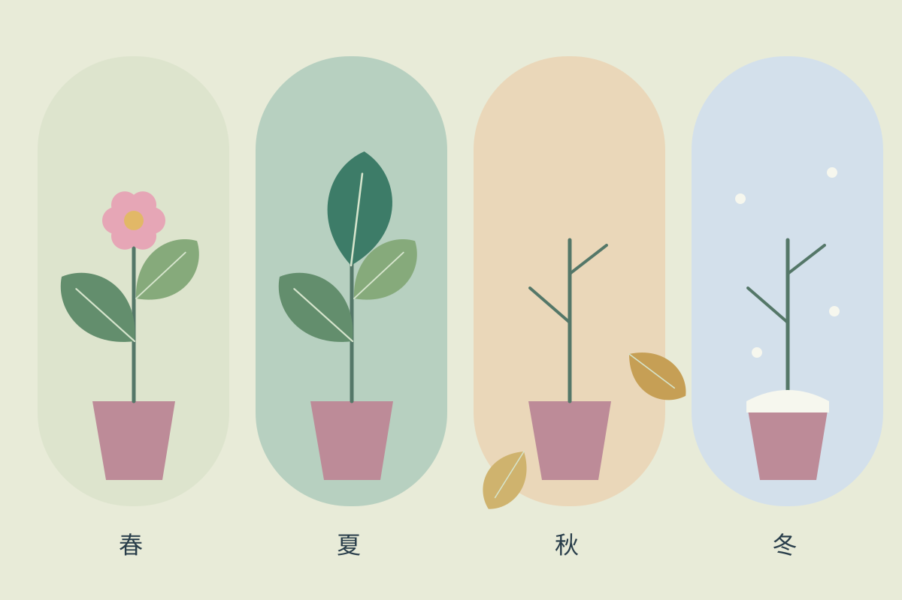

## 留住一座庭院

想象中的庭院只有一把椅子、几盆植物和一条窄窄的小路。系列并不追求植物学的准确记录，而是观察一年里光照、叶形与人的停留方式如何变化。

## 有限的形状

圆叶、长叶和小花共用几组简单的轮廓。夏天让叶片越过边缘，秋天保留空出来的枝条；同一个粉色花盆成为四幅画之间的线索。

## 系列延伸

封面选择生长最盛的夏末，内页以四格记录季节变化。画面、情节与“岛页”署名均为本站原创虚构演示，没有真实委托关系。
