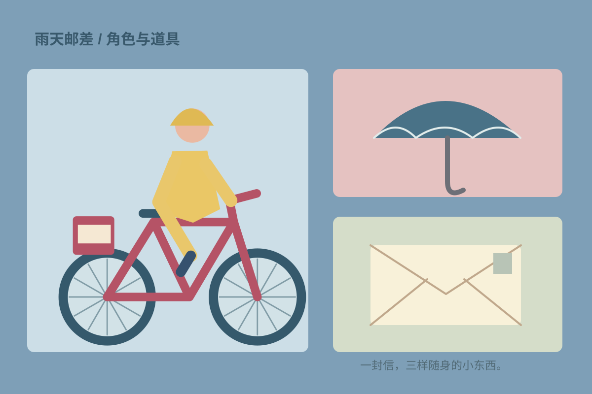

## 故事起点

这是一段虚构图画书练习：小镇里最后一封信被雨水打湿了，邮差决定在天黑前找到收信人。封面选择旅途中最平常的街景，而不是故事的结局。

## 角色与色彩

黄色雨衣让人物在蓝色雨幕里保持清楚，自行车的红色呼应远处屋顶。房屋窗户的大小并不严格遵循透视，它们为路人的视线留下一个个停顿。

## 从一张图到一个系列

先确定人物的雨衣轮廓，再用同一组道具延伸出路口、桥边与门前的场景。这里展示封面与道具设定，全部文字和图形均为原创虚构内容，并非客户或出版项目。
