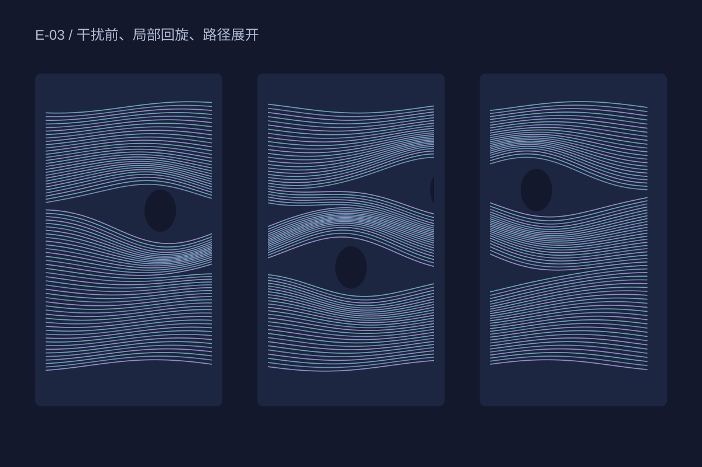

## 一个方向，三处干扰

七十二条曲线从画布左端进入，三个圆形区域改变附近路径的弯曲幅度。障碍本身保持空白，用负形显现，而不是画出实体球体。

## 密度成为空间

当线条靠拢，颜色变得更密；当线条分开，深色背景重新出现。两者共同形成一个没有地面与天空的空间。构图保留贯穿画面的主方向，让局部回旋不会破坏整体阅读。

## 静态实验

这些路径按原创公式绘制，仅用于艺术构成。它不求解流体方程，不表示实际风速、水流或工程结果。
