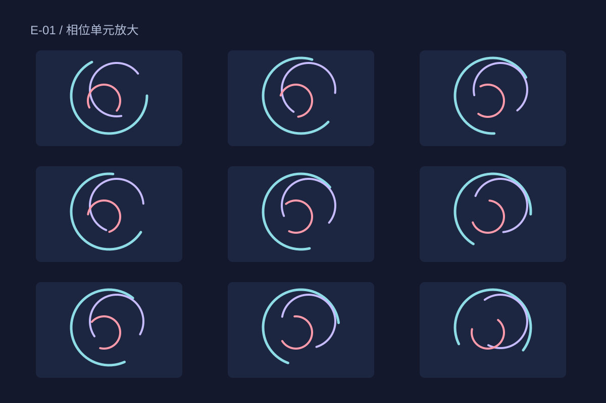

## 起始规则

将十二列、八行的单元排在同一张画布上。每个单元包含三条圆弧，角度随位置偏移；半径的变化保持在小范围内，让图像仍能读出网格。

## 一次构成

青色弧线负责连贯感，淡紫短线让视线在单元之间停留。中心区域增加圆弧的重合，边缘保留较多空白，形成类似生长又不指向真实植物的形态。

## 记录边界

作品是原创静态矢量图，不读取实时数据。单元放大图用来说明构成规则；它不是花卉观测、声波可视化或科学模拟。
