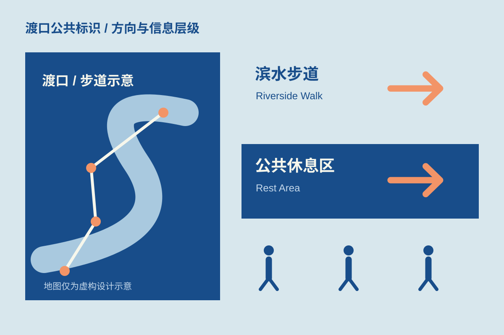

## 方向优先

渡口是一组自拟滨水空间导视练习。设计从“人在路口停下来时要知道什么”出发：先判断方向，再确认目的地与距离。

## 路径成为标志

弯曲岸线与直线路径构成一个可以重复使用的符号。蓝白建立清楚的文字对比，橙色仅标记方向与当前位置。地图采用示意关系，避免伪装成可用于导航的真实测绘。

## 验证边界

这里展示符号与版面关系，没有真实设施、施工尺寸或现场测试结果。实际公共导视还需要结合场地、规范、可达性和安装条件验证；本页仅为原创虚构设计案例。
