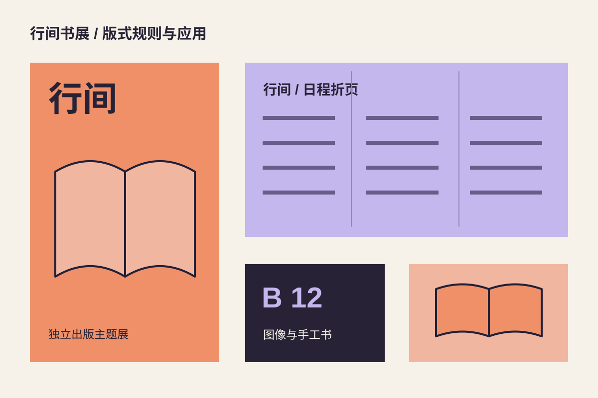

## 从阅读开始的命题

“行间”是一场虚构的独立出版主题展。主视觉需要在远处形成明确的整体，折页则要容纳读者在现场寻找展位和活动的具体信息。

## 同一规则，两种密度

打开的书页成为视觉骨架。海报把字行拉开，让空白成为画面；日程折页缩短间距并增加分组，让阅读顺序更清楚。橙色用于入口，淡紫用于停留与阅读区域。

## 在现场使用

展位牌只显示编号与类别，复杂日程放在折页内。示意编号与文字都是设计演示，不代表实际活动或场地。所有应用图形均为原创 SVG。
