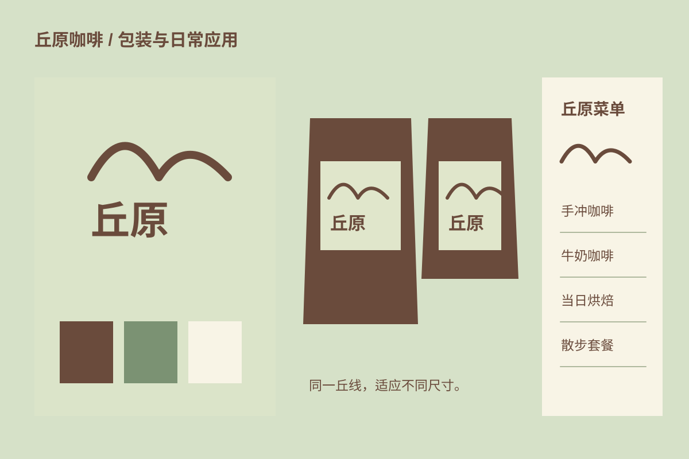

## 一家想象中的街角店

丘原是一个虚构咖啡店命题。设计想保留散步途中停下来喝一杯的轻松感，因此避免使用产区地图或未经证实的品质宣称。

## 丘线与留白

两道高低不同的丘线组合成标志。包装让标志留在上半部，下半部预留给名称和配方信息；浅绿、咖啡棕与白色在纸杯和菜单上交换主次。

## 细节如何延续

杯套保留最少信息，菜单扩大行距以便站在柜台前阅读。图中器物由原创矢量图形搭建，没有实物拍摄、真实商标或客户交付关系。
