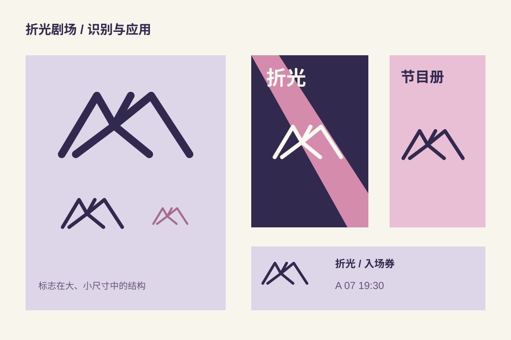

## 命题与受众

“折光”是自拟的小剧场品牌。命题关注第一次来观看演出的年轻观众：他们需要先识别场所，再理解当晚演出的气氛。这里没有真实客户、剧场或演出。

## 识别线索

标志用三道斜折线建立舞台与光束之间的关系。深紫保留剧场暗场的感受，粉色光块承担信息之外的情绪。标志缩小到票券时，只保留线条骨架。

## 应用检查

海报先建立剧名与日期的阅读顺序，票券再突出座位和入场信息。示意图展示构成与尺寸关系，不含真实演出数据；图形与文字均为原创虚构设计。
